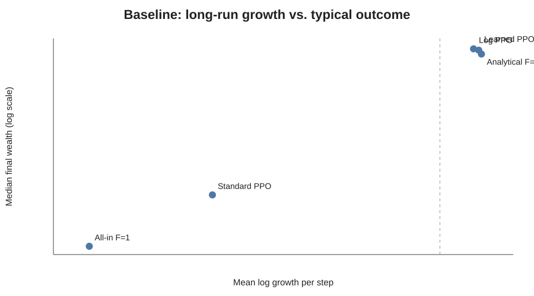
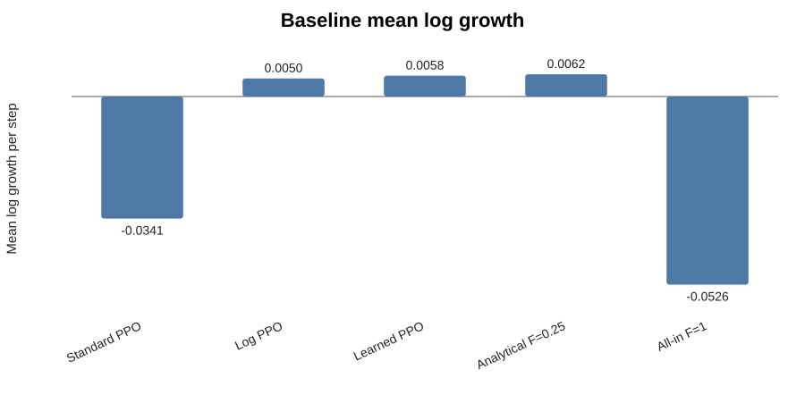
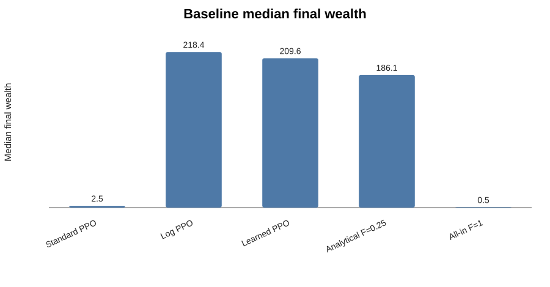
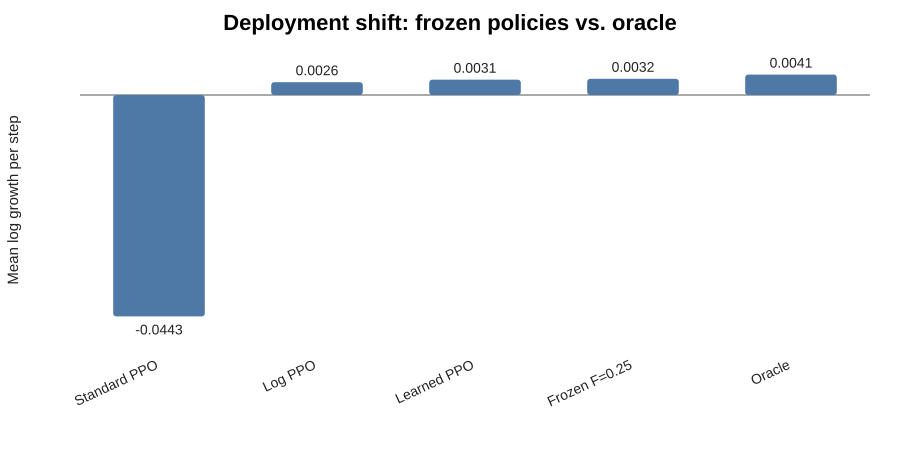
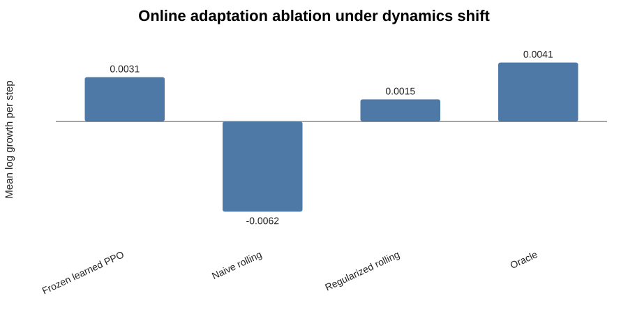
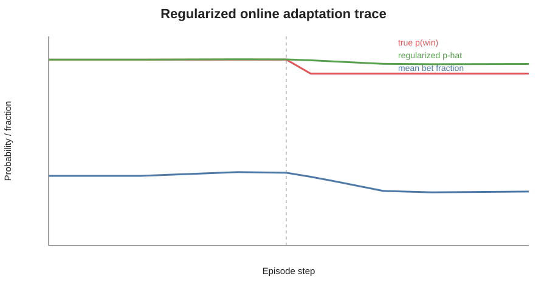

# Ergodicity-Aware RL Under Deployment Dynamics Shift

A compact, modernized study of **ergodicity-aware reinforcement learning**, learned reward transformations, and adaptation under a deployment-time change in dynamics.

The project compares conventional PPO with log-transformed and learned-transform PPO on a multiplicative coin-toss process, then introduces a hidden shift in $p(\text{win})$ to expose the gap between a good frozen policy and a genuinely adaptive one.

## 1. Core question

> What changes when an RL agent optimizes expected wealth instead of long-run trajectory growth, and what happens when the deployment dynamics later change?

The project has three layers:

1. **Ergodicity-aware objective** — compare standard, log, and learned-transform PPO.
2. **Deployment shift** — change $p(\text{win})$ during the episode without retraining.
3. **Online adaptation** — estimate the new regime online and adjust the bet fraction.

---

## 2. Environment

At each step the agent chooses a bet fraction $F\in[0,1]$.

- Win multiplier: $1+0.5F$
- Loss multiplier: $1-0.4F$
- Initial wealth: $W_0=100$
- Episode length: 100 steps
- PPO action space: normalized to $[-1,1]$, then mapped to $F\in[0,1]$

For the stationary case with $p(\text{win})=0.5$, the analytical log-growth optimum is

$
F^*=0.25.
$

The learned ergodicity transform is estimated from trajectory data using a LOWESS estimate of local increment variance and numerical integration of its inverse square root.

---

## 3. Baseline comparison

All policies are evaluated on the **same 5,000 random trajectories**.

| Policy | Mean final wealth | Median final wealth | Mean log growth | P(final wealth < 100) | Mean bet |
|---|---:|---:|---:|---:|---:|
| Standard PPO | 700.85 | 2.49 | -0.03414 | 0.6516 | 0.8091 |
| Log PPO | 231.40 | 218.43 | 0.00505 | 0.1900 | 0.2098 |
| Learned-transform PPO | 267.34 | 209.64 | 0.00583 | 0.2234 | 0.2242 |
| Analytical $F=0.25$ | 348.58 | 186.10 | 0.00623 | 0.3126 | — |
| All-in $F=1$ | 5668.86 | 0.52 | -0.05262 | 0.8608 | — |

At $W=100$:

| Policy | Bet fraction |
|---|---:|
| Standard PPO | 0.8743 |
| Log PPO | 0.2375 |
| Learned-transform PPO | 0.2368 |
| Analytical optimum | 0.2500 |

The learned transform is nearly identical in shape to the logarithm:

- correlation with $\log(x)$: **0.999984**
- monotonicity: **passed**
- fast interpolation normalized max error: **1.45×10⁻⁵**



### Mean log growth



### Median final wealth



**Interpretation:** maximizing ensemble mean wealth can produce aggressive policies with poor typical long-run outcomes, while log and learned-transform objectives produce positive long-run growth.

---

## 4. Deployment dynamics shift

The environment is changed during evaluation only:

- steps 1–50: $p(\text{win})=0.50$
- steps 51–100: $p(\text{win})=0.47$
- no PPO retraining

The analytical log-optimal action changes from

$
F^*=0.25 \quad\rightarrow\quad F^*=0.115.
$

### Frozen-policy results

| Policy | Mean log growth | Median final wealth | Mean bet pre-shift | Mean bet post-shift |
|---|---:|---:|---:|---:|
| Standard PPO frozen | -0.04429 | 0.88 | 0.8284 | 0.8047 |
| Log PPO frozen | 0.00257 | 187.76 | 0.2201 | 0.2084 |
| Learned-transform PPO frozen | 0.00307 | 171.63 | 0.2309 | 0.2317 |
| Frozen $F=0.25$ | 0.00324 | 148.88 | — | — |
| Oracle regime-aware | 0.00407 | 150.81 | 0.2500 | 0.1150 |



**Interpretation:** the frozen ergodicity-aware policies remain much better than standard PPO, but they do not fully adapt to the new regime. This creates a clear **adaptation gap** relative to the oracle.

---

## 5. Online adaptation

The online estimator uses recent binary outcomes to estimate $\hat p$, then maps that estimate to the analytical log-optimal fraction

[
F^*$\hat p$=\mathrm{clip}(4.5\hat p-2,0,1).
]

### Naive rolling estimator

A short unregularized rolling window correctly detects the shift, but noise in $\hat p$ is amplified by the nonlinear action mapping. The result is over-aggressive betting and negative mean log growth:

- mean log growth: **-0.00623**

### Regularized estimator

A Beta-Bernoulli regularized estimator with a prior centered at 0.5 stabilizes the estimate.

| Policy | Mean log growth | Median final wealth | Mean bet pre-shift | Mean bet post-shift |
|---|---:|---:|---:|---:|
| Learned-transform PPO frozen | 0.00307 | 171.63 | 0.2309 | 0.2317 |
| Naive rolling adaptive | -0.00623 | 42.81 | 0.3039 | 0.2736 |
| Regularized adaptive | 0.00153 | 94.70 | 0.2549 | 0.2240 |
| Oracle regime-aware | 0.00407 | 150.81 | 0.2500 | 0.1150 |



The regularized estimator avoids catastrophic overreaction, but adapts too slowly. By step 100 its mean estimate remains around 0.491 while the true post-shift value is 0.47.



**Interpretation:** online adaptation introduces a bias-variance tradeoff. Naive adaptation is too noisy; strong regularization is stable but slow. The oracle result shows the remaining room for a better continual-learning mechanism.

---

## 6. What this project demonstrates

- Reproduction of the key non-ergodic RL effect with current Gymnasium / Stable-Baselines3.
- Comparison of standard, log, and **learned** ergodicity-aware reward representations.
- Recovery of behavior close to the analytical log-growth optimum.
- A deployment-time dynamics shift without retraining.
- A measurable gap between frozen and regime-aware policies.
- A compact online-adaptation study showing both overreaction and over-regularization failure modes.

---

## 7. Project structure

```text
ergodic-continual-rl/
├── environments/
│   ├── coin_toss.py
│   ├── ergodicity_transform.py
│   ├── fast_transform.py
│   ├── learned_transform_env.py
│   ├── win_rate_estimator.py
│   ├── regularized_win_rate_estimator.py
│   └── adaptive_fraction.py
├── experiments/
│   ├── run_coin_toss_reproduction.py
│   ├── train_learned_transform_agent.py
│   ├── compare_three_agents.py
│   ├── evaluate_deployment_shift.py
│   ├── evaluate_adaptive_shift.py
│   ├── evaluate_regularized_adaptive_shift.py
│   └── test_*.py
├── figures/
├── models/
└── results/
```

---

## 8. Reproduce

Install dependencies:

```bash
pip install -r requirements.txt
```

Run core checks:

```bash
python -m experiments.test_coin_toss
python -m experiments.test_ergodicity_transform
python -m experiments.test_fast_transform
python -m experiments.test_learned_transform_env
python -m experiments.test_win_rate_estimator
python -m experiments.test_regularized_estimator
```

Run the main experiments:

```bash
python -m experiments.run_coin_toss_reproduction
python -m experiments.train_learned_transform_agent
python -m experiments.compare_three_agents
python -m experiments.evaluate_deployment_shift
python -m experiments.evaluate_regularized_adaptive_shift
```

---

## 9. Methodological note

This is a **modernized mathematical reproduction and small extension**, not a line-for-line reproduction of the original public code.

Notable implementation choices:

- the standard baseline uses the physically transparent wealth increment $W_{t+1}-W_t$;
- PPO actions are normalized to $[-1,1]$ before mapping to $F\in[0,1]$;
- the learned transformation is precomputed on a logarithmic grid and interpolated during PPO training;
- deployment-shift evaluations use common random numbers for fair policy comparisons.

---

## 10. Limitations

- PPO results currently use a **single training seed**.
- The online adaptive controller is deliberately simple and analytical.
- The deployment-shift experiment is a small proof of concept, not a full continual-RL algorithm.
- The coin-toss process is intentionally minimal and should be followed by a richer dynamical-control environment for broader conclusions.

---

## 11. Reference

Inspired by:

**Dominik Baumann, Erfaun Noorani, James Price, Ole Peters, Colm Connaughton, Thomas B. Schön**  
*Reinforcement learning with non-ergodic reward increments: robustness via ergodicity transformations.*  
Transactions on Machine Learning Research, 2025.

Original implementation: **baumanndominik/ergodic_rl**

---

## Status

**Frozen application-ready research artifact.**

The current repository is intended to demonstrate understanding of ergodicity-aware RL, deployment shift, and the motivation for adaptive / continual policies. The next research step would be a multi-seed study and a richer dynamical-control environment rather than further tuning of this toy example.
